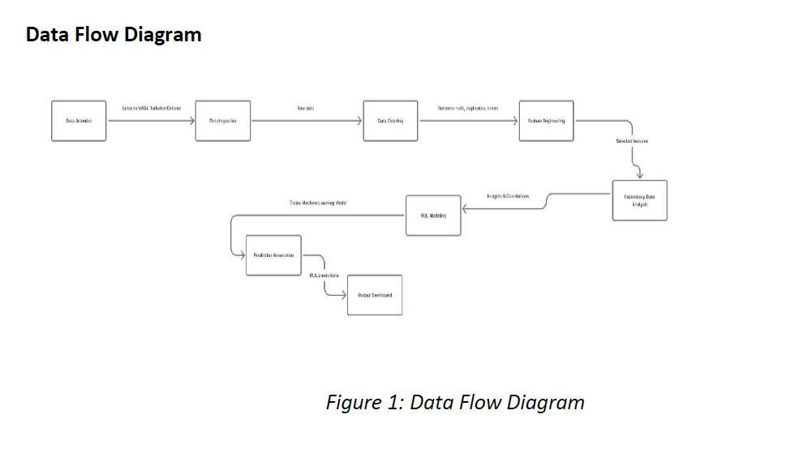
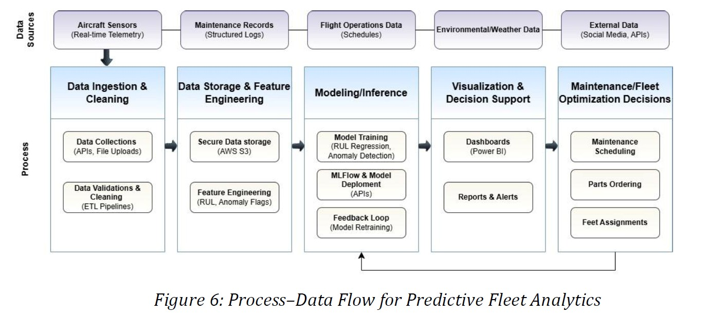
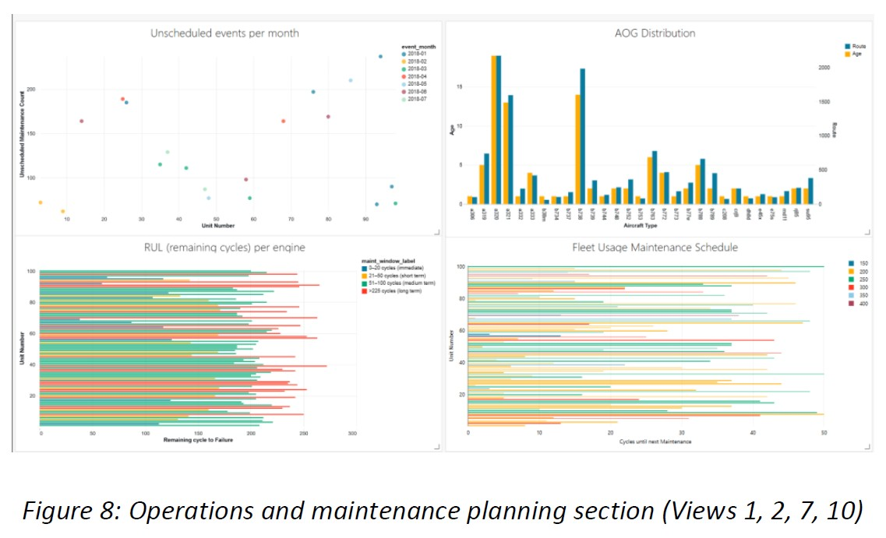
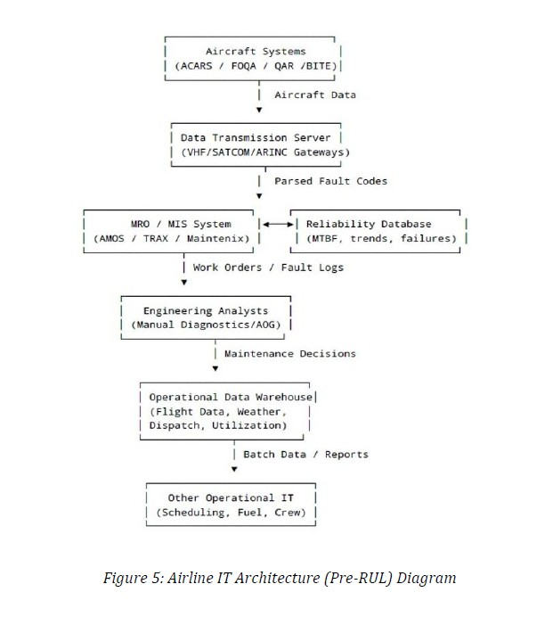

# Fleet Predictive Analytics

A predictive maintenance analytics project for commercial aviation that uses machine learning and operational data to estimate remaining useful life, identify maintenance windows, and support better maintenance planning.

## Overview
This project combines aviation maintenance logs, engineered features, and predictive modeling to help detect aircraft-on-ground risk and estimate maintenance timing.

## Tools & Technologies
- Python
- Pandas
- NumPy
- Scikit-learn
- TensorFlow / Keras
- Databricks
- AWS S3
- Jupyter Notebook

## Project Goals
- Predict remaining useful life (RUL)
- Support predictive maintenance decisions
- Reduce unplanned downtime
- Improve maintenance planning visibility

## Workflow
1. Data collection and integration
2. Data cleaning and preprocessing
3. Exploratory data analysis
4. Feature engineering
5. LSTM model development
6. Maintenance risk classification
7. Results interpretation

## Screenshots

### EDA Chart

### Model Workflow

### Maintenance Window Output

### AOG Risk Band

### Architecture View

## Key Features
- LSTM-based predictive modeling
- Maintenance window grouping
- AOG risk band analysis
- Cloud-supported workflow with Databricks and AWS S3

## Files
- `fleet-predictive-analytics.ipynb` — main notebook
- `Capstone_Final_Report_Group_7.pdf` — project report
- `images/` — screenshots and charts

## Results
- Predictive maintenance workflow using aircraft sensor and maintenance data
- RUL-oriented output to support maintenance scheduling
- Risk segmentation for maintenance prioritization

## About Me
Thully Johny  
Data Analyst | Power BI | SQL | Python | Excel | Cloud-supported analytics workflows

## Connect
- LinkedIn: https://linkedin.com/in/thully
